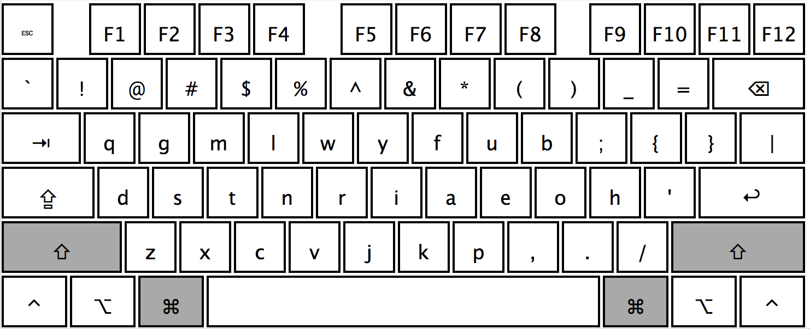

# Rockstar Keyboard Layout

__NOTE__: this is work in progress, works on OS X only at the moment.

If you really want to be a rockstar programmer, you like totally need an
appropriately named keyboard layout which is optimized for that 10x performance!

In an essence this is a variation on the QGMLWY layout from the
[carpalx project](http://mkweb.bcgsc.ca/carpalx/?full_optimization). They key
features are the following:

* Fully optimized layout for the best typing efficiency so far known to humans
* Keeps ZXCV at the same place as QWERTY
* Keeps S and Q in their original place as well
* Keeps several keys in the same spot as Colemak/Workman

On top of that I've added several programmer specific optimizations

* Swapped numbers and symbols for more efficient programming in general
* Swapped `_` and `-` for easier snake style variable names
* Swapped `[]` and `{}` for easier curly brackets access in JavaScript/CSS/...
* Swapped `|` and `\` so that logical operator would be accessible same as `&`

Here is the picture

## Installation

* Git clone all the stuff somewhere
* Copy `Rockstar.bundle` into your `/Library/Keyboard Layouts` folder (create if it is missing)
* Sign out, Sign in
* Go to the keyboard preferences and add the `Rockstar` layout
* Ask here in issues if nothing works

## Training

If you want to give this a go, I have created a custom support module for the
[TypeFu app](http://type-fu.com):

https://github.com/MadRabbit/typefu-rockstar-support

Let me know if you create support for something else, I'll add it in here.

## Copyright & License

I'm not sure if there is a point in this, but if anyone asks, it's all MIT.

I guess this makes me a traditionalist. Maybe I should grow a stash or something...

Copyright (C) 2016 Nikolay Nemshilov
